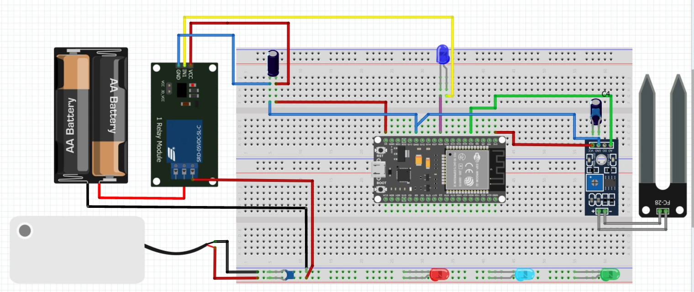

# ESP32 Smart Soil Moisture & Pump Controller 🌱

## About This Project
This is a smart plant watering system we built for our project using an ESP32. The goal was to create a reliable system that reads soil moisture and automatically waters the plant when it gets too dry. 

Instead of just a basic ON/OFF switch, we added Bluetooth connectivity. We built a system that lets you switch between **Auto Mode** (where the sensor does the work) and **Manual Mode** (where you control the pump directly). We also made sure all the settings can be adjusted on the fly using a custom mobile app.

---

## How the Core Logic Works
We didn't want the pump to just turn on and off randomly, so we programmed specific rules and timers using `millis()` (non-blocking delays). Here is how the brain of the system works:

### 1. Moisture Thresholds (When to water)
*   **Dry Trigger (Low Humidity):** When the soil moisture drops below this percentage, the ESP32 turns the pump **ON**.
*   **Target Moisture (Max Humidity):** The pump stays on and keeps watering until the soil moisture reaches this target percentage, then it turns **OFF**.

### 2. Safety Timers (Protecting the pump and your room)
*   **Minimum Run-Time:** Once the pump turns on, it *must* run for this amount of time, even if the sensor suddenly reads high moisture. This prevents the pump from rapidly clicking on and off, which could damage the motor.
*   **Maximum Timeout:** This is a fail-safe. If the pump runs for this maximum allowed time, it forces a shut-off. This is crucial just in case the sensor falls out of the dirt or breaks—it stops the pump from emptying the whole water tank onto the floor.
*   **5-Second Cooldown:**
**After the pump turns off(especially if it hit the Maximum Timeout), the system enters a strict 5 - second rest period.During this time, it won't check the sensor or turn the pump back on, giving the water time to soak into the soil and the hardware a moment to reset.

---

## Hardware & Connections 🔌

We designed the circuit to keep the logic side(ESP32) safe from the power side (Water Pump). 

### Components We Used:
*   ESP32 Development Board
*   5V Active-Low Relay Module
*   Analog Soil Moisture Sensor
*   Mini DC Water Pump (3V-5V)
*   Some LEDs
*   Capacitors (to filter out motor noise and prevent the ESP32 from restarting)

### 📌 Pin Connections

| Component | ESP32 Pin / Power | Note |
| :--- | :--- | :--- |
| **Moisture Sensor Analog Output (AO)** | `VP` (GPIO 34) | Reads analog moisture values |
| **Moisture Sensor (Power)** | `3.3V` | Powered directly by ESP32 |
| **Relay Signal (IN)** | `D26` (GPIO 26) | Connected via a series Blue LED |
| **Relay Power (VCC)** | `VIN` or `5V` pin | Needs 5V to switch the magnetic coil |
| **Relay NO Terminal** | Pump Positive terminal | 	Outputs power to the pump only when the relay is triggered (Normally Open) |
| **Relay COM terminal** | Battery Positive terminal | Acts as the main power input from the external battery source |
| **Pump Negative terminal** | Battery negative terminal | Completes the high-power circuit for the water pump motor |
| **Bluetooth** | Built-in | No external wiring needed |
| **Grounds** | `GND` | All grounds must be connected together |
| **Electrolytic Capacitors** | VCC & GND of sensor and relay (in parallel) | 47μF capacitance; acts as a local energy buffer to prevent voltage drop |
| **Ceramic Capacitors** | VCC & GND of sensor and water pump (in parrallel) | 100nF capacitance; filters out high-frequency electrical noise |

### you can see how all components are connected in the picture shown below:
  
---

## 🛠️ A Cool Hardware Trick: The 5V Relay Problem
While building the circuit, we ran into a frustrating hardware bug. We used a **5V Active-Low Relay**, which means it turns ON when the signal is LOW ($0V$) and OFF when the signal is HIGH.

**The Problem:**
The ESP32 pins only output $3.3V$. When we sent a `HIGH` signal to turn the relay OFF, there was a voltage difference between the relay's $5V$ power and the ESP32's $3.3V$ pin:
$$\Delta V = 5V - 3.3V = 1.7V$$
This $1.7V$ leakage was enough to keep the relay's internal circuit slightly awake. The relay's built-in LED stayed dimly lit, and sometimes it wouldn't let the pump shut off properly. 

**Our Solution:**
Instead of buying different parts, we put a **Blue LED in series** between the ESP32's `D26` pin and the relay's `IN` pin. 
A blue LED requires a forward voltage of about $2.5V$ to $3.0V$ to let current pass. 
*   When the ESP32 is `HIGH` ($3.3V$), the $1.7V$ leakage is smaller than the LED's $2.5V$ requirement ($1.7V < 2.5V$). The LED acts like a wall, blocking the current entirely and forcing the relay **100% OFF**.
*   When the ESP32 is `LOW` ($0V$), the difference is $5V$. This easily pushes through the LED, turning the relay **ON** with a clean signal.
---

## 📱 The Mobile App

To make the system truly smart, we designed a companion mobile application that connects to the ESP32 via Bluetooth. 

*(You can add a screenshot of your app here)*
``

**App Features:**
*   **Live Monitoring:** View the current soil moisture percentage in real-time.
*   **Mode Toggling:** A simple switch to bounce between Auto and Manual modes.
*   **Manual Pump Control:** A button to directly turn the pump ON/OFF (only works when Manual Mode is active).
*   **Settings Sliders/Inputs:** Easily adjust the *Dry Trigger*, *Target Moisture*, *Minimum Run-Time*, and *Maximum Timeout* directly from your phone without having to rewrite or upload new code to the ESP32.

---

## 💻 Software Architecture

The code is written in C++ (Arduino framework). Aside from the timers mentioned earlier, the biggest software challenge we tackled was **Bluetooth Communication**.

When we sent settings from the app, sometimes the commands would arrive glued together (for example, sending a minimum time of 1 and a max time of 2 would show up as `n1x2`). At first, the ESP32 only read the first number and ignored the rest. 

We completely rewrote the Bluetooth parser. We used the `indexOf()` function to search the incoming text for specific letters (like 'n' for min time, 'x' for max time, 'L' for dry trigger). Now, the ESP32 can chop up glued-together strings and update all the settings accurately at the same time.

---

## 👥 The Team
We are a team of 4 students. To get this project working, we split the tasks like this:
1.  **Hardware & Circuits:** Figured out the wiring, fixed the 5V relay leakage issue, and handled the noise-filtering capacitors.
2.  **Firmware (C++):** Wrote the ESP32 logic, `millis()` timers, and the custom Bluetooth text parser.
3.  **App Development:** Built the user interface for the phone and formatted the Bluetooth data packets.
4.  **Documentation:** Tracked our bugs, organized the GitHub repository, and put together this README.
